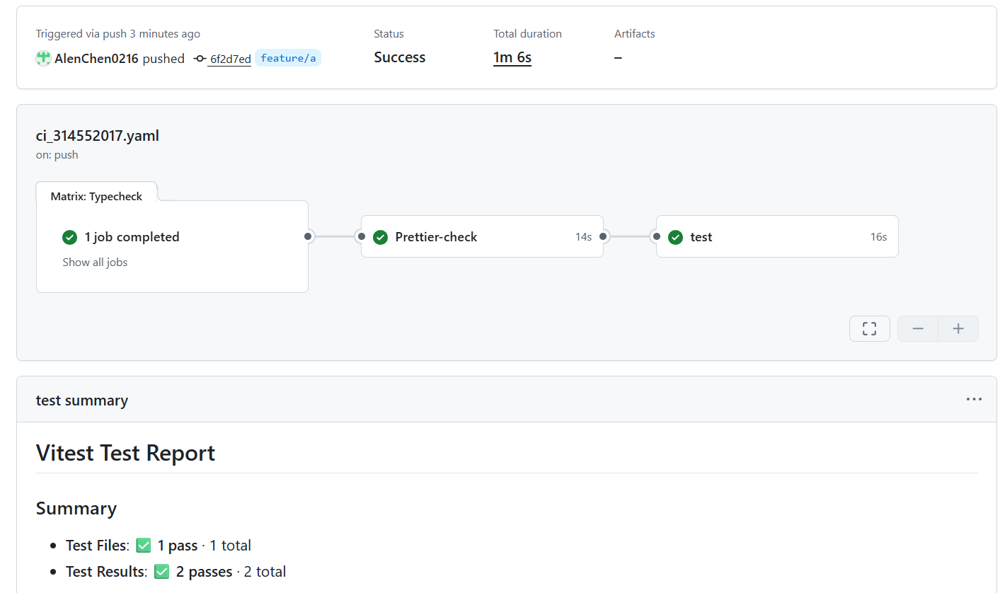
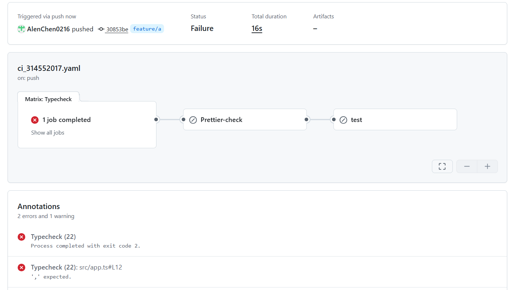
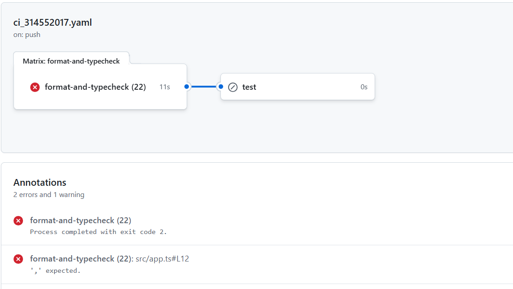
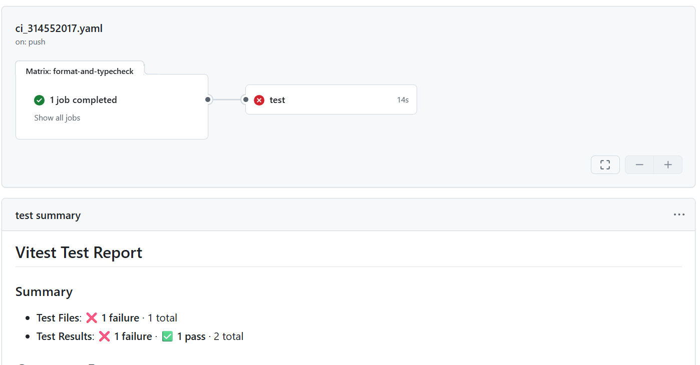
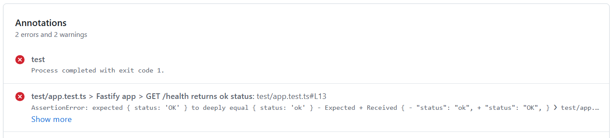

# 2026 CI/CD HW 報告

**學號/姓名**：314552017 (請填寫姓名)

---

## 1. CI Pipeline 說明

**設計策略與實作工具：**
本專案的 CI Pipeline 建立於 GitHub Actions 上，為達到自動化驗證的目的，Pipeline 設定在有程式碼 `push` 或 `pull_request` 時觸發。Pipeline 被設計為兩階段的任務 (`jobs`)，利用工作之間的依賴關係（`needs`）來確保品質順序：

1. **`format-and-typecheck`**：
   - 作為首要的檢查防線，執行 TypeScript 的型別檢查 (`npm run typecheck`) 以及 Prettier 的格式檢查 (`npm run format:check`)。
   - 確保所有推上的程式碼都符合型別安全且遵循統一撰寫風格。任一檢查報錯，Pipeline 就會立即中止並顯示失敗。

2. **`test`**：
   - 依賴 `format-and-typecheck` 工作通過後才會執行。
   - 執行單元測試並產生測試覆蓋率 (`npm test -- --coverage`)。
   - **整合至介面**：額外安裝了 `vitest/coverage-v8`，並修改專案中的 `vitest.config.ts`，設定測試覆蓋率的 provider 為 `v8`，並加上 `json-summary` 與 `json` 格式輸出（設定 `reportOnFailure: true` 以應對錯誤情況）。
   - 最後使用第三方 Action `davelosert/vitest-coverage-report-action@v2`，讀取產出的覆蓋率報告，並將測試結果直接顯示在 GitHub Actions 的 Summary 結果頁面。

**Pipeline YAML 主要內容 (`.github/workflows/ci_314552017.yaml`)：**

```yaml
name: ci_314552017

on:
  push:
    branches:
      - '**'
  pull_request:

concurrency:
  group: ci-${{ github.workflow }}-${{ github.ref }}
  cancel-in-progress: true

jobs:
  format-and-typecheck:
    runs-on: ubuntu-latest
    strategy:
      fail-fast: false
      matrix:
        node-version: ['22']
    steps:
      - name: Checkout
        uses: actions/checkout@v4
      - name: Setup Node.js
        uses: actions/setup-node@v4
        with:
          node-version: ${{ matrix.node-version }}
          cache: npm
      - name: Install dependencies
        run: npm ci
      - name: TypeScript typecheck
        run: npm run typecheck
      - name: Prettier check
        run: npm run format:check

  test:
    runs-on: ubuntu-latest
    needs: format-and-typecheck
    steps:
      - name: Checkout code
        uses: actions/checkout@v4
      - name: Setup Node.js
        uses: actions/setup-node@v4
        with:
          node-version: ${{ matrix.node-version }}
          cache: npm
      - name: Install dependencies
        run: npm ci
      - name: Run tests
        run: npm test -- --coverage
      - name: 'Report Coverage'
        if: always()
        uses: davelosert/vitest-coverage-report-action@v2
```

---

## 2. CI 執行結果截圖

_(在此貼上您成功執行 GitHub Actions Workflow 的畫面，特別要包含測試結果與 Coverage 顯示於 GitHub Actions 頁面的結果截圖)_




---

## 3. 失敗案例說明

_(請根據您實際操作的失敗案例進行填寫，以下提供填寫範本：)_

- **故意製造的錯誤與原因**：
  我故意將程式碼修改造成 **[ TypeScript 型別錯誤 / Prettier 格式錯誤 / 測試失敗 ]**。例如：將某個 `src` 目錄下已經寫好正確斷言的測試案例 `expect` 改為不正確的值（測試失敗）。當這段修改推送到 GitHub 之後，CI/CD Pipeline 將會嘗試執行上述定義好的 Workflow。此時對應的檢查或測試指令 (`npm test` 或 `npm run typecheck`) 將會報錯並退出且產生 Non-zero exit code，根據 GitHub Actions 原則，這個步驟與後續尚未執行的步驟都會失敗或被終止。

- **修正方式**：
  在本地端重新檢查發生錯誤的地方，將測試檔或錯誤的原始程式碼改回正常符合邏輯與規範的內容，並確保能在本地端使用 `npm run test` 或相關指令成功通過後，再 `git commit & push` 到 GitHub 觸發新一輪的 CI Pipeline，即可順利轉為通過狀態。

- **失敗結果截圖**：
  _(在此貼上 Pipeline Failed 的結果頁面截圖)_

1. TypeScript 型別錯誤 :

- 故意製造的錯誤與原因 :

  我故意在 `src` 目錄下的 `/` api 回傳值 Dictionary中，加上 `;`。當這段修改 push 到 Github 後，Github Action將會嘗試執行上述定義好的 Workflow。此時， `npm run typecheck` 會顯示下圖的錯誤訊息並退出。根據 GitHub Actions 原則，這個步驟與後續尚未執行的步驟都會失敗或被終止。

- 修正方式 :

  將多添加的 `;` 刪除。

- 失敗結果截圖 :



2. Prettier 格式錯誤 :

- 故意製造的錯誤與原因 :

  我故意在

3. 測試失敗 :

- 故意製造的錯誤與原因 :

  我故意將 `src` 目錄下的 `app.ts` 的 `/health` api 回傳值改成 `OK`。 當這段修改 push 到 Github 後，Github Action將會嘗試執行上述定義好的 Workflow。此時， `npm test -- --coverage` 會因為 testcase 中的 `expect(response.json()).toEqual({ status: 'ok' });` 不滿足而無法通過測試。

- 修正方式 :

  將`/health` api 回傳值改成正確的 `ok`

- 失敗結果截圖 :



